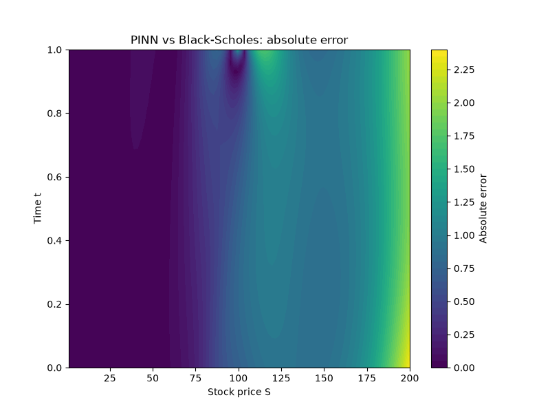

# Black-Scholes PINN

A Physics-Informed Neural Network (PINN) that solves the Black-Scholes PDE for European call option pricing, validated against the closed-form analytical Black-Scholes formula.

## Overview

Rather than training on labelled price data, this project trains a neural network to satisfy the Black-Scholes partial differential equation directly:

∂V/∂t + ½σ²S²(∂²V/∂S²) + rS(∂V/∂S) − rV = 0

The network learns the entire option pricing surface `V(S, t)` using only:
- The PDE itself, enforced at randomly sampled points across the domain (via automatic differentiation)
- Two known boundary conditions: the payoff at expiry, and the asymptotic behaviour as S → ∞

No historical or simulated price data is used — the PDE and boundary conditions alone are shown to be sufficient to reconstruct the full known analytical solution.

## Architecture

- 2 inputs (stock price `S`, time `t`) → 3 hidden layers (64 units each) → 1 output (option price `V`)
- `Tanh` activations were chosen deliberately over the more common `ReLU`, since the physics loss requires computing the network's *second* derivative — `ReLU`'s second derivative is zero almost everywhere, which would break training

## Loss function

Two (later three) components, combined into a single training objective:

1. **PDE residual loss** — samples random `(S, t)` points and penalises deviation from the Black-Scholes equation, using `torch.autograd.grad` to compute the network's own derivatives
2. **Terminal (expiry) boundary loss** — anchors the network to the known payoff `max(S−K, 0)` at `t = T`
3. **Far-field boundary loss** — anchors the network to the known asymptotic price `S − K·e^(−r(T−t))` as `S → S_max`

## Results

| | Before far-field condition | After far-field condition |
|---|---|---|
| Mean absolute error | 1.14 | 0.64 |
| Max absolute error | 18.51 | 2.38 |

Adding the far-field boundary condition reduced mean absolute error by ~44% and max absolute error by ~87%.

**Finding:** the largest remaining error consistently occurs at the domain corner (S = S_max, t = 0) — the point furthest from both boundary conditions. This is consistent with known PINN behaviour: information from boundary conditions propagates through the PDE loss, but points furthest from any anchor are the hardest to constrain accurately.

## Why Black-Scholes

Black-Scholes was chosen because it has a known closed-form analytical solution, allowing rigorous validation of the PINN's accuracy against ground truth. In practice, the real value of the PINN approach is for PDEs *without* closed-form solutions (e.g. American options with early exercise, or stochastic volatility models), where traditional numerical methods become expensive — this project demonstrates the method on a case where correctness can be independently verified.

## Generality

The training loop, network architecture, and derivative computation are entirely PDE-agnostic — only the residual line in the loss function and the boundary conditions are specific to Black-Scholes. The same code could be adapted to a different PDE (or option type, e.g. a put) by changing only those two components.

## Tech stack

Python, PyTorch, NumPy, SciPy, Matplotlib

## Files

- `model.py` — network architecture
- `train.py` — training loop and loss functions
- `evaluate.py` — validation against the analytical Black-Scholes formula, error analysis, heatmap generation
